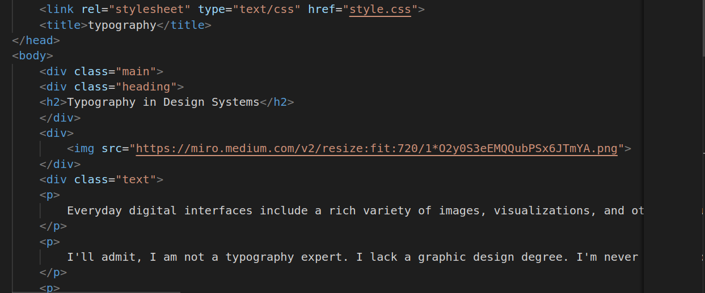
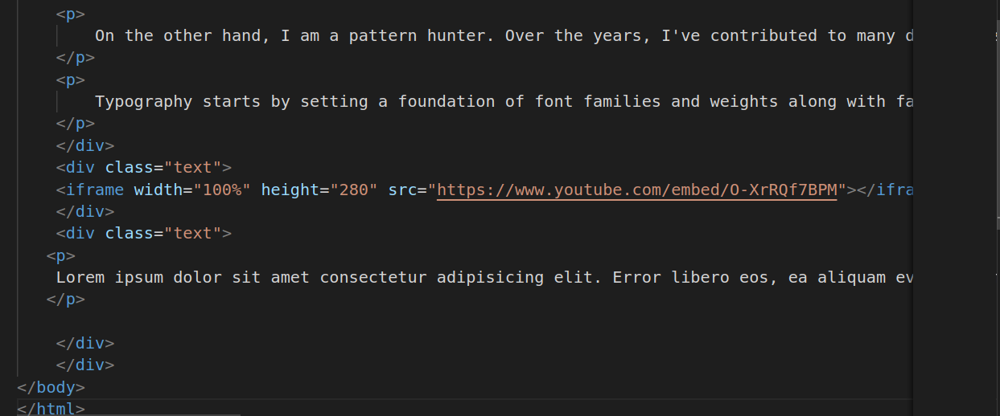
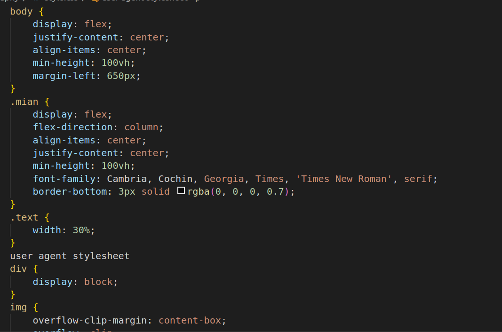
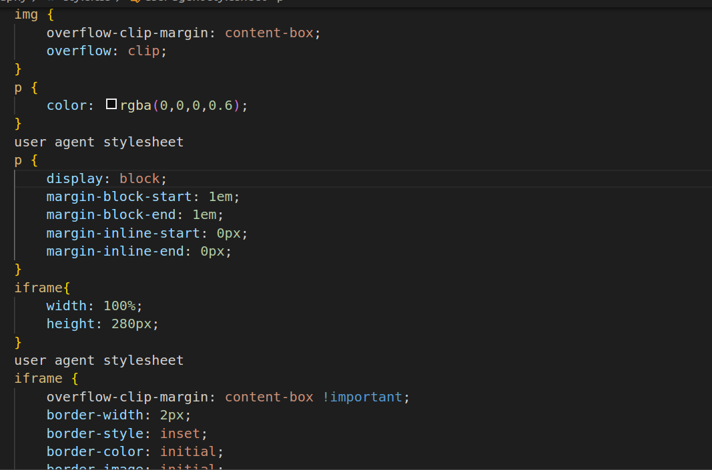
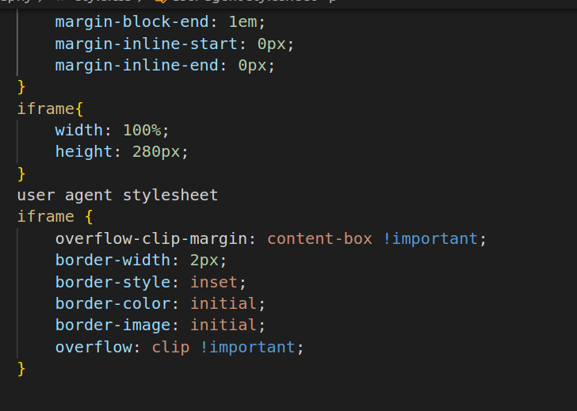

 # Typography
1.
2.

* link This line links an external CSS stylesheet named "style.css" to HTML document. It's used to apply styles and formatting HTML content.
* The div element with the class "main." It's used to create a container or section of your web page. Classes like "main" are often used to apply specific styles.
* The div element with the class "heading" is used to create a container or section within the "main" container. 
* h2 :This is a level 2 heading that serves as the title for a section. Headings are used to structure and organize content.
* div:This empty div element doesn't have any content or attributes. It might be a placeholder or could be intended for future content.
* This img element displays an image with the specified source URL. The src attribute points to the image file, which will be displayed on the webpage.
* The div Another element with the class "text" is used to create a container or section. It's likely used to group and style text-related content.
* p :These are paragraph elements that contain text content. They are used to structure and present textual information on the webpage. Each element represents a separate paragraph or block of text.
* iframe: This iframe element embeds a video from YouTube. It has specified dimensions (width and height) and a source URL (src) pointing to the YouTube video.
* p:This is another p element that contains text content. It appears after the iframe and contains Lorem Ipsum text.

3.

4.

5.

* body:display: flex: This property is used to change the display mode of the body element to a flex container. It allows you to use flexbox layout to arrange its child elements.
* justify-content: center: This property centers the child elements horizontally within the flex container 
* align-items: center: This property centers the child elements vertically within the flex container.
* min-height: 100vh: This sets the minimum height of the body to 100% of the viewport height. It ensures that the content takes up at least the full height of the viewport.
* margin-left: 650px: This adds a left margin of 650 pixels to the entire body. Be cautious with this because it may affect the centered alignment achieved by justify-content and align-items.
* display: flex: Like in the body, this property makes the element with the class "main" a flex container.
* flex-direction: column: This property sets the direction of the flex container's main axis to be vertical, which stacks child elements vertically.
* align-items: center: Centers child elements horizontally within the flex container.
* justify-content: center;: Centers child elements vertically within the flex container.
* min-height: 100vh: Sets the minimum height of the "main" container to 100% of the viewport height.
* font-family: Cambria, Cochin, Georgia, Times, 'Times New Roman', serif: Specifies the font family for text within the "main" container.
* border-bottom: 3px solid rgba(0, 0, 0, 0.7): Adds a 3-pixel solid black border to the bottom of the "main" container.
* .text, img, p, iframe:These are selectors for various HTML elements. You can use these selectors to apply specific styles to elements of those types.
* The iframe selector defines styles for iframe elements, setting their width to 100% and height to 280 pixels, while adding some border properties.